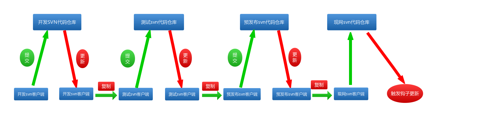

# updateTool

* php开发流程化部署代码更新脚本工具，方便更新，回滚，比较差异
* 基于svn服务器管理代码更新脚本化工具

### 一，概述

* 该工具主要用于通过操作svn命令来方便代码更新，回滚，比较差异。
* 建议各个svn仓库都搭建在一台外网服务器上，避免跨网络，导致网络不通。

 
### 二，示例图

图1：

图2：


 

### 三，特性

* 更新流程，一般分为开发，测试，预发布，现网等环境（如图1）
* 代码工具，可以方便的，从开发到测试，测试到预发布，预发布到现网，实现流程化的代码更新，可以配合敏捷开发工具使用。
* 这里只是提供php开发的脚本化工具源码，svn的服务器环境，可以按照图1，自行安装部署
* 开发人员只要提起svn日志文件路径， 给相关更新人员，使用工具，依次更新到现网。
        
   
### 四，环境依赖

>需要搭建svn
    
* php ，php开启shell_exec函数
    
    
### 五，开始使用

* 1，提取开发svn更新日志，合并成需要更新的列表文件，

例如更新文件列表如下：

```
	conf/payconf.php
	conf/comm.php
	public/api/test.html
	application/models/Home/Service/Midaspay.php
	application/models/Home/Service/Wxgamepay.php
	application/models/Home/Service/Wxmppay.php
	application/modules/Api/controllers/Wxpay.php
```

> 注意路径只保留根目录下的路径， 前面删除

* 2，提交列表给各个环境更新，使用updateTool工具更新

例如：更新测试部代码

进入测试部更新工具目录，把上面列表路径配置到file.txt文件，执行命令，就更新完成

         
* 3，工具代码文件目录路径如下 ：

```

updateTools.php
file.txt
log/

``` 

直接执行命令查看使用说明，执行命令如下（如图2）：

```
php updateTools.php

``` 


### 六，联系方式

* qq：251413215


